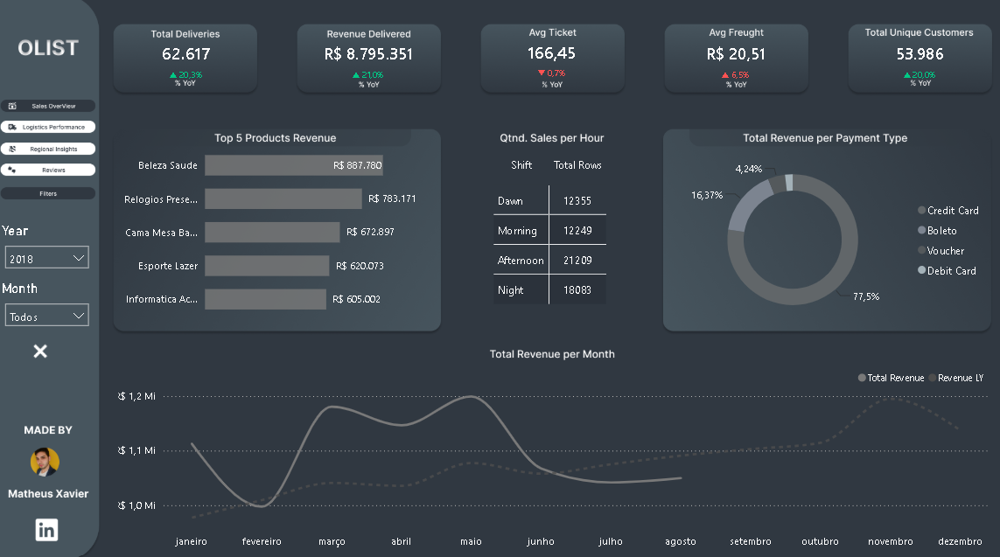
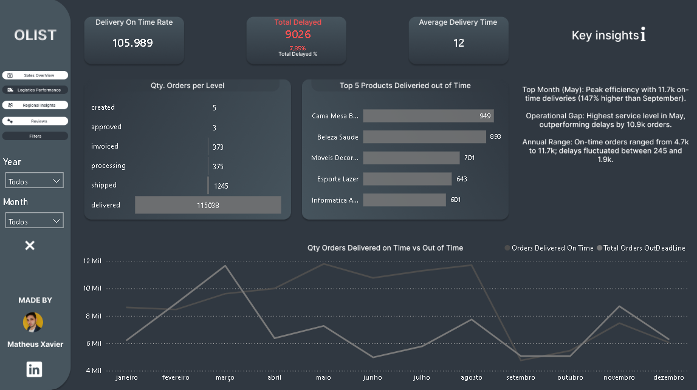
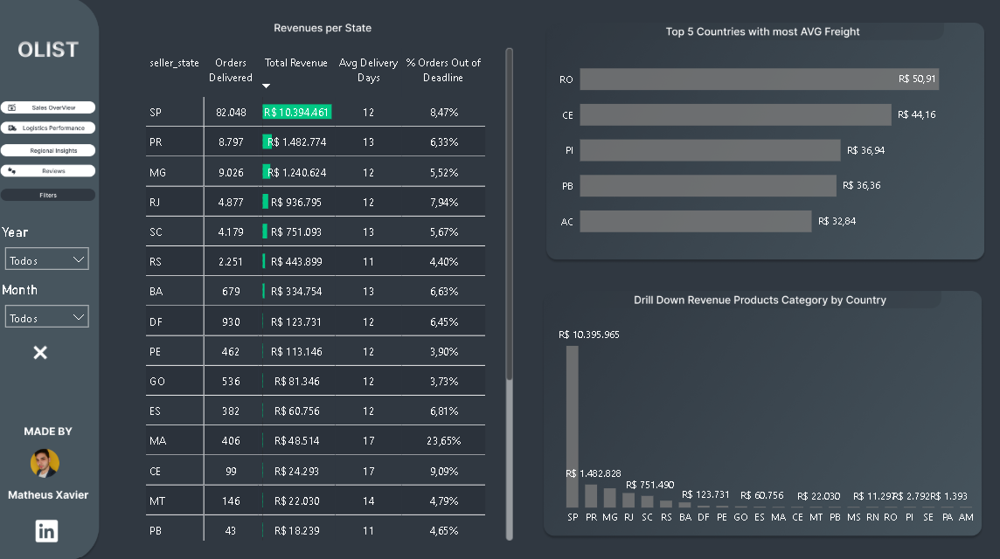
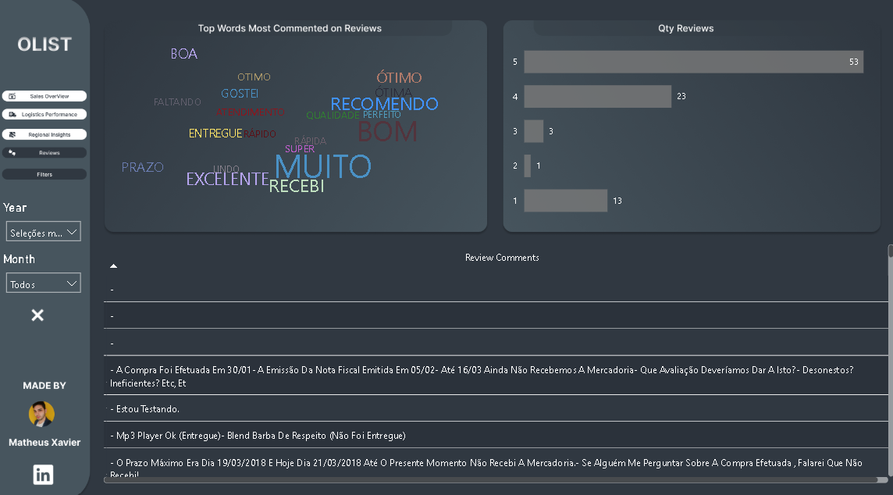

## 📊 Executive Analytics Report

---

### 📈 Page 1: Sales Overview – Commercial Performance & Revenue Drivers

#### 🚀 Financial Growth Drivers
* **Market Traction (YoY Growth):** The operation showcases solid expansion, hitting **62.6k deliveries** and **R$ 8.79M in total revenue**. A healthy **~21% Year-over-Year (YoY) growth** is uniformly reflected across order volume, revenue, and unique customer acquisition, confirming real market-share expansion.
* **Sazonalidade (Análise de Tendência):** The historical line chart reveals a massive, aggressive revenue peak in **May**, driven by Mother's Day seasonality, where monthly sales soared past **R$ 1.1M**. Furthermore, the 2018 revenue line baseline consistently outperformed the previous year across all active months.

#### 🛍️ Category & Payment Trends
* **Revenue Concentration:** *Beleza & Saúde* (R$ 887k) and *Relógios & Presentes* (R$ 783k) stand out as the primary financial engines of the platform, requiring strict supply-chain and seller-retention monitoring.
* **Conversion Windows:** Credit Card is the heavily preferred payment method (**77.5% share**). Peak transactional traffic scales sharply during the **Afternoon (21.2k orders)** and **Night (18k orders)** shifts, marking the ideal windows for targeted marketing campaigns.

---

### 📦 Page 2: Logistics Performance – Fulfillment Funnel & Annual Seasonality

* **Funnel Volume:** The fulfillment framework demonstrates optimal structural health, with **115,038 orders** successfully reaching final *delivered* status from initial processing states (*created*, *approved*, *invoiced*, *processing*, *shipped*).
* **Volumetric Delivery Friction:** Heavy and high-cubage goods are the primary drivers of deadline breaches. The **Cama, Mesa & Banho** category leads the log in delayed shipments (**949 orders out of deadline**), followed by *Beleza & Saúde* (893) and *Móveis Decoração* (701), proving the need for regionalized fulfillment centers for bulk items.
* **Operational Peak vs. Valley:** Logistical compliance is highly sensitive to annual seasonality. **May stands out as the operational peak**, scaling to **11.7k on-time deliveries** with minimal friction. Conversely, **September marks the operational valley**, where on-time shipments drop to **4.7k** while delays spike to **1.9k orders**, exposing capacity constraints.

---

### 🗺️ Page 3: Regional Insights – Geographic Intelligence & Freight Disparities

* **The SP Powerhouse:** São Paulo (SP) is the absolute core of the business, single-handedly commanding **82k orders** and **R$ 10.39M in revenue**. An **8.47% delay rate** on this massive scale reflects a highly robust regional fulfillment system.
* **Freight Cost Outliers:** Data reveals severe regional asymmetries. Remote states like **Rondônia (RO)** and **Ceará (CE)** register the highest average freight costs in Brazil, hitting **R$ 50.91** and **R$ 44.16**, respectively, highlighting infrastructure challenges that penalize local conversion margins.
* **SLA Critical Bottlenecks:** **Maranhão (MA)** represents the highest operational risk. Deliveries stretch to an average of **17 days**, causing a critical SLA failure where **23.65% of all shipments breach their deadlines** (nearly 1 in 4 orders). 
* **Benchmark Operacional:** The state of **Minas Gerais (MG)** showcases excellent efficiency. Being the second largest regional hub, it manages to maintain the lowest delay rate among major states (**5.52%**) and a healthy average delivery time of 12 days.

---

### 💬 Page 4: Customer Reviews – Sentiment & Satisfaction Auditing

* **Sentiment Overview:** Customer perception is highly positive overall, with top-tier ratings dominating the platform (**Score 5 leads with 53 reviews**, followed by Score 4 with 23 reviews).
* **The Logistical Delay Link:** Auditing lower spectrums (**Score 1 with 13 reviews**) maps a direct correlation to logistical failures. Textual parsing reveals that poor scores are explicitly triggered by delivery bottlenecks and delays.
* **Textual Value Extraction (Word Cloud):** By executing source-level text transformation and isolating `review_comment_title`, the word cloud cleanly exposes core customer sentiments. Positive tokens like **"RECOMENDO"**, **"EXCELENTE"**, and **"ÓTIMO"** dictate the visual weight, while **"PRAZO"** and **"ENTREGA"** act as the central operational anchors driving customer satisfaction or detraction.
