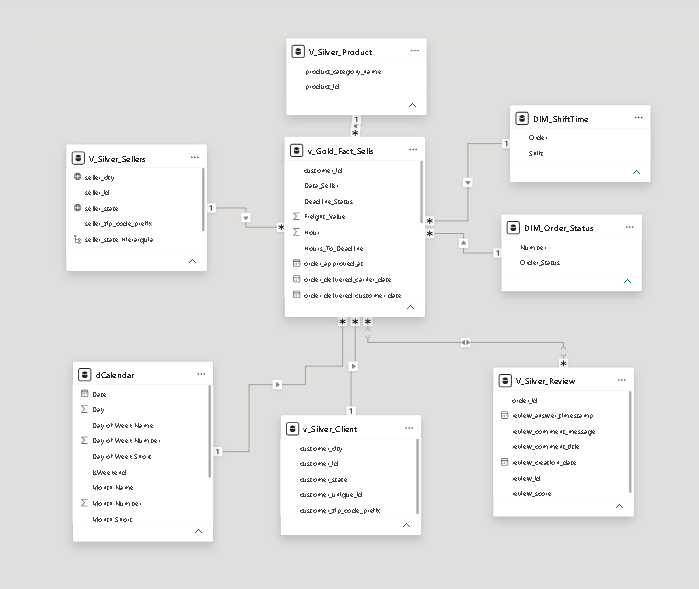

# 📦 Olist E-Commerce Sales & Logistics Intelligence

This repository contains a robust, enterprise-grade Business Intelligence and Data Engineering solution developed using the public Olist dataset (Brazilian E-Commerce platform). The project focuses on SQL-driven data quality correction, relational abstraction, dimensional modeling, logistical SLA compliance, and customer sentiment analytics.

⚠️ **Note:** This project was developed under a Power BI Desktop license, so a live cloud link is not available. Due to GitHub's file size limitations, the `.pbix` analytical file and the raw source data are hosted externally. To inspect the architecture, data model, and custom DAX measures, please follow the execution steps detailed below.

---

## 🛠️ Tech Stack & Implementation Details

The project separates the data engineering/preparation layer from the visualization engine to guarantee scalability, performance, and clear business logic rules.

* **SQL Server (Transact-SQL):** Utilized as the primary data engineering and ETL engine. Responsible for database schematization, relational data cleansing, advanced string handling, timestamp logic correction, and data type standardization at the source level.
* **Figma:** Used as the UI/UX design platform to architect user-centric layouts, micro-containers, and a custom visual hierarchy tailored for dark mode, drastically reducing Power BI rendering overhead.
* **Power BI Desktop:** Implemented as the primary analytics engine for semantic model building, relationship configurations, and canvas orchestration.
* **DAX (Data Analysis Expressions):** Engineered to handle advanced time intelligence, strict operational SLA calculations, context manipulation, and custom text aggregation boundaries (`CALCULATE`, `COUNTROWS`, `DIVIDE`, and hierarchical evaluation contexts).

---

## 🏛️ Architecture & Data Modeling

### 🧩 Relational Abstraction via SQL Scripting

Instead of importing raw, noisy operational files directly into the BI engine, a structural data engineering layer was built in SQL Server. The full pipeline script is version-controlled and stored within the `archives/` directory of this repository:

* **SLA & Time Logic Correction:** Fixed broken operational timestamps by implementing standard chronological constraints via SQL logic (establishing clean delivery day metrics from approved payment to client handoff), avoiding inverted time calculations common in the raw dataset.
* **Text Processing & NLP Preparation:** Performed string isolation on customer reviews (`review_comment_title`). Applied trimming and character cleansing at the database level to isolate operational sentiment from textual noise before feeding the semantic model.
* **De-duplication Policy:** Enforced strict transaction boundaries by removing repeated order IDs in the review metrics using SQL optimization techniques, preventing data multiplication when mapping across dimensions.

### 🕸️ Data Model Blueprint: Star / Galaxy Schema Architecture

The analytical engine is organized under a hybrid star-schema layout designed to support cross-filtering between e-commerce sales performance, geographic shipping costs, and customer satisfaction metrics.

#### 🔗 Dimensional Relationship Mapping:

Filters propagate efficiently through strict, single-direction (1:N) relationships from dimensions down to core facts, maintaining strict isolation of evaluation contexts:

* **Operational Filters:** `dCustomers` and `dSellers` filter the core `fSales` table via `customer_id` and `seller_id`.
* **The Review Junction:** The `fOrderReviews` table links directly to `fSales` through a strict relationship via `order_id`, allowing real-time correlation between logistical delays and low customer scores.
* **Time Intelligence:** A customized, continuous `dCalendar` table acts as the single chronological source of truth, filtering all transactional metrics across financial months and years.

---

## 🎨 UI/UX Design Philosophy

Every dashboard layout was custom-designed using Figma before visual development. This approach allowed for:
* **Performance Optimization:** Flat image backgrounds reduce active visual rendering times within the Power BI canvas.
* **Consistent Visual Hierarchy:** Custom-built containers designed specifically for dark mode KPI cards, optimizing screen real estate, alignment, and cognitive scanability for stakeholders.

---

## 🚀 How to Run and Inspect the Project

Follow these steps to download the file and review the active relationships, data types, and measures:

### 1. Prerequisites
Ensure you have the following tools installed on your machine:
* **Power BI Desktop** (Free download from the Microsoft Store).
* *(Optional)* **SQL Server Management Studio (SSMS)** or VS Code to inspect the data preparation scripts located in the `archives/` folder.

### 2. Running the Project
1.  Clone this repository or download the files as a ZIP by clicking on the green **Code** button at the top right, then selecting **Download ZIP**.
2.  Navigate to the `archives/` folder to inspect the SQL server cleaning data pipeline.
3.  Download the complete Power BI dashboard file directly from this [Secure External Storage Link (Google Drive)](https://drive.google.com/drive/folders/1Rn_RYnhl9UCGr6jf6eU1cmkRwoDA6bPU?usp=sharing).
4.  *(Optional)* If you wish to inspect the raw transactional records, the original dataset is available at the official [Olist Kaggle Repository](https://www.kaggle.com/datasets/olistbr/brazilian-ecommerce).
5.  Open Power BI Desktop, navigate to your local downloads folder, and open the file named **`Olist_Sales_Logistics_Intelligence.pbix`** (or your exact file name downloaded from Drive).
6.  The project will load automatically. All data, semantic relational links, M queries, and custom DAX measures are fully embedded within the file—no database deployment or local file re-routing is required to fully inspect the environment.

📈 **Looking for business insights?** Check out the full [Executive Analytics Report](ANALYSIS.md) for a deep dive into sales seasonality, freight outliers, logistical bottlenecks, and customer sentiment trends.
